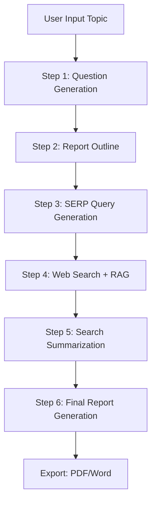

# Deep Research Report Generation System

A comprehensive deep research report generation system that automates the creation of in-depth research reports through a 6-step workflow using LLM, RAG, and web search technologies.

---

## Table of Contents

- [Project Overview](#project-overview)
- [Features](#features)
- [Prerequisites](#prerequisites)
- [Installation](#installation)
- [Configuration](#configuration)
- [Running the Application](#running-the-application)
- [Project Structure](#project-structure)
- [API Endpoints](#api-endpoints)
- [6-Step Workflow](#6-step-workflow)
- [Dataset](#dataset)
- [Tech Stack](#tech-stack)
- [License](#license)

---

## Project Overview

This system implements a 6-step automated workflow for generating comprehensive research reports. Users simply input a research topic, and the system automatically completes the entire process from question generation to final report delivery.

### System Flow



---

## Features

- **LLM Integration** - Powered by Dashscope (Alibaba Cloud) with LangChain and MCP support
- **RAG Knowledge Base** - Vector-based retrieval using Qdrant for semantic search
- **Web Search** - Tavily API integration for real-time search
- **Search Enhancement** - Query Expansion, Re-ranking, and RRF fusion for improved search quality
- **Streaming Output** - Real-time streaming responses for better UX
- **Multi-format Export** - PDF and Word document generation
- **6-Step Workflow** - Complete automation from topic to report
- **Report Evaluation** - Automated quality assessment using G-Eval metrics

---

## Prerequisites

Before running this application, ensure the following services are installed and running:

| Service | Version | Description | Default Port |
|---------|---------|-------------|--------------|
| Redis | - | Cache and session storage | 6379 |
| MySQL | - | Relational data storage | 3306 |
| MongoDB | - | Document storage | 27017 |
| Qdrant | 1.7.0+ | Vector database | 6333 |
| MinIO | - | Object storage (OSS) | 9000 |

### External API Keys Required

- **Dashscope API Key** - For LLM and Embedding services ([Get from Alibaba Cloud](https://dashscope.console.aliyun.com/))
- **Tavily API Key** - For web search functionality ([Get from Tavily](https://tavily.com/))

---

## Installation

### Backend Setup

1. Navigate to the project root directory:

```bash
cd e:\learning\FYP\Code\FYP_dev
```

2. Install Python dependencies:

```bash
pip install -r requirements.txt
```

### Frontend Setup

1. Navigate to the frontend directory:

```bash
cd frontend
```

2. Install Node.js dependencies:

```bash
npm install
```

---

## Configuration

### Backend Configuration

Create or edit `config.py` in the project root to configure your environment:

```python
# Redis Configuration
REDIS_HOST = "localhost"
REDIS_PORT = 6379
REDIS_PASSWORD = "your_password"
REDIS_DB = 14

# MySQL Configuration
MYSQL_HOST = "localhost"
MYSQL_PORT = 3306
MYSQL_USER = "root"
MYSQL_PASSWORD = "your_password"
MYSQL_DATABASE = "deep-research"

# MongoDB Configuration
MONGO_HOST = "localhost"
MONGO_PORT = 27017
MONGO_DATABASE = "deep-research"
MONGO_USERNAME = "admin"
MONGO_PASSWORD = "your_password"

# LLM Configuration (Dashscope)
LLM_BASE_URL = "your_base_url"
LLM_API_KEY = "your_dashscope_api_key"
LLM_MODEL = "qwen3-3"

# Tavily Search API
TAVILY_API_KEY = "your_tavily_api_key"

# OSS Configuration (MinIO)
OSS_ENDPOINT = "localhost:9000"
OSS_ACCESS_KEY = "your_access_key"
OSS_SECRET_KEY = "your_secret_key"
OSS_BUCKET = "your-bucket"
```

### Frontend Configuration

The frontend proxies API requests to the backend. Ensure `vite.config.ts` has the correct proxy configuration:

```typescript
export default defineConfig({
  server: {
    port: 5173,
    proxy: {
      '/api': {
        target: 'http://localhost:8000',
        changeOrigin: true,
      }
    }
  }
})
```

---

## Running the Application

### Start Backend Server

From the project root directory:

```bash
uvicorn main:app --reload --host 0.0.0.0 --port 8000
```

The backend API will be available at `http://localhost:8000`

API documentation can be accessed at:
- Swagger UI: `http://localhost:8000/docs`
- ReDoc: `http://localhost:8000/redoc`

### Start Frontend Server

From the frontend directory:

```bash
npm run dev
```

The frontend will be available at `http://localhost:5173`

---

## Project Structure

```
FYP_dev/
├── main.py                    # Backend entry point
├── config.py                  # Configuration settings
├── requirements.txt           # Python dependencies
│
├── api/                      # API route modules
│   ├── __init__.py          # Router aggregation
│   ├── api_base.py          # Basic endpoints (health check)
│   ├── api_report.py        # Report management
│   ├── api_write_report_ask_questions.py  # Question generation
│   ├── api_write_report_plan.py          # Outline generation
│   ├── api_write_report_serp.py          # SERP query generation
│   ├── api_write_report_search.py        # Web search execution
│   ├── api_write_report_search_summary.py # Search summarization
│   ├── api_write_report_final.py         # Final report generation
│   ├── api_rag_knowledge.py              # Knowledge base management
│   └── api_evaluation.py                 # Report evaluation
│
├── models/                   # Data models
│   ├── models.py           # Pydantic request/response models
│   ├── mongo_models.py     # MongoDB document models
│   └── step_models.py      # Step record models
│
├── services/               # Business logic services
│   ├── llm_service.py           # LLM integration (LangChain + MCP)
│   ├── rag_service.py          # RAG knowledge base (Qdrant)
│   ├── mcp_client_service.py   # MCP client for tools
│   ├── tavily_service.py       # Tavily search API
│   ├── report_service.py       # Report management
│   ├── step_record_service.py   # Step tracking
│   ├── search_enhancement_service.py  # Query expansion, re-ranking, RRF
│   ├── report_evaluation_service.py  # G-Eval evaluation
│   ├── mongo_api_service_manager.py   # MongoDB API manager
│   ├── mongo_stream_storage_service.py # Streaming storage
│   ├── task_service.py          # Task management
│   ├── oss_service.py           # OSS operations
│   └── image_service.py        # Image validation/upload
│
├── utils/                  # Utility modules
│   ├── database.py        # Redis, MySQL, MongoDB connections
│   ├── logger.py          # Logging configuration
│   ├── exception_handler.py # Global exception handling
│   ├── response_models.py  # Response models
│   ├── distributed_lock.py # Redis distributed lock
│   ├── api_key_manager.py # Tavily API key management
│   └── ai_tool_api.py     # AI tool API integration
│
└── frontend/               # React TypeScript frontend
    ├── package.json
    └── src/
        ├── api/           # API client functions
        ├── components/     # Reusable UI components
        ├── pages/          # Page components (Step1-6)
        ├── hooks/         # Custom React hooks
        ├── types/          # TypeScript type definitions
        ├── App.tsx        # Main application component
        └── main.tsx       # Application entry point
```

---

## API Endpoints

### Report Management

| Method | Endpoint | Description |
|--------|----------|-------------|
| POST | `/api/report/create` | Create new report |
| GET | `/api/report/detail/{report_id}` | Get report details |
| GET | `/api/report/list` | List reports (paginated) |
| GET | `/api/report/history` | Get report history |
| GET | `/api/report/progress/{report_id}` | Get execution progress |
| GET | `/api/report/step-result/{report_id}/{step_name}` | Get step result |
| GET | `/api/report/token-stats/{report_id}` | Get token statistics |
| POST | `/api/report/lock` | Lock/unlock report |
| DELETE | `/api/report/{report_id}` | Delete report |

### 6-Step Workflow

| Step | Method | Endpoint | Description |
|------|--------|----------|-------------|
| 1 | POST | `/api/ask_questions/stream` | Generate research questions |
| 2 | POST | `/api/plan/stream` | Generate report outline |
| 2 | POST | `/api/plan/split/{report_id}` | Split outline into chapters |
| 3 | POST | `/api/serp/stream` | Generate SERP queries |
| 4 | POST | `/api/search/search` | Execute enhanced searches |
| 5 | POST | `/api/summary/completion` | Summarize search results |
| 6 | POST | `/api/final/stream` | Generate final report |

### Export

| Method | Endpoint | Description |
|--------|----------|-------------|
| GET | `/api/final/download/pdf/{report_id}` | Download as PDF |
| GET | `/api/final/download/word/{report_id}` | Download as Word |

### Knowledge Base

| Method | Endpoint | Description |
|--------|----------|-------------|
| POST | `/api/knowledge/upload` | Upload document |
| DELETE | `/api/knowledge/document/{document_id}` | Delete document |
| GET | `/api/knowledge/documents` | List documents |
| GET | `/api/knowledge/document/{document_id}` | Get document details |
| POST | `/api/knowledge/search` | Search knowledge base |
| GET | `/api/knowledge/stats` | Get statistics |
| POST | `/api/knowledge/init` | Initialize knowledge base |

### Evaluation

| Method | Endpoint | Description |
|--------|----------|-------------|
| POST | `/api/evaluation/evaluate/{report_id}` | Trigger evaluation |
| GET | `/api/evaluation/evaluation/{report_id}` | Get evaluation results |

---

## 6-Step Workflow

### Step 1: Question Generation
Generate relevant research questions based on user input to enrich the report plan.

**Endpoint**: `POST /api/ask_questions/stream`

### Step 2: Report Outline
Create a detailed report outline with chapter structure.

**Endpoint**: `POST /api/plan/stream`

After outline is generated, split it into chapters:

**Endpoint**: `POST /api/plan/split/{report_id}`

### Step 3: SERP Query Generation
Generate search engine query lists for each chapter section.

**Endpoint**: `POST /api/serp/stream`

### Step 4: Web Search + RAG
Execute hybrid searches combining:
- **Tavily API** - Real-time web search
- **RAG Knowledge Base** - Semantic search on uploaded documents

Enhanced search features:
- **Query Expansion** - Expands single query into multiple sub-queries
- **Re-ranking** - LLM-based result re-ranking
- **RRF Fusion** - Reciprocal Rank Fusion for result merging

**Endpoint**: `POST /api/search/search`

### Step 5: Search Summarization
Summarize collected search results into structured learning content.

**Endpoint**: `POST /api/summary/completion`

### Step 6: Final Report Generation
Generate complete reports with:
- Chapter-by-chapter content
- Introduction
- Summary
- References

**Endpoint**: `POST /api/final/stream`

### Export
Download completed reports in various formats:

**Endpoint**: `GET /api/final/download/pdf/{report_id}`
**Endpoint**: `GET /api/final/download/word/{report_id}`

---

## Dataset

This project includes a **self-generated dataset** used for training and evaluation purposes.

### Dataset Description

The dataset consists of:
- Research topics and queries
- Generated questions and outlines
- Search results from Tavily
- RAG retrieval results
- Final generated reports
- Evaluation metrics (Context Precision, NDCG, G-Eval scores)

### Dataset Location

The dataset files are included in the **Supporting Documents ZIP file** submitted alongside this code. Please refer to the included dataset documentation for detailed information about the data structure and usage.

---

## Tech Stack

### Backend
- **FastAPI** - Web framework
- **LangChain** - LLM framework
- **LangGraph** - Agent workflow
- **Pydantic** - Data validation
- **SQLAlchemy** - ORM
- **Motor** - Async MongoDB driver
- **Redis** - Caching & distributed locks

### AI/ML
- **Dashscope** - LLM & Embedding services
- **Tavily** - Web search API
- **Qdrant** - Vector database
- **LangChain MCP Adapters** - Tool integration

### Data Processing
- **ReportLab** - PDF generation
- **python-docx** - Word document generation
- **PyPDF** - PDF text extraction
- **MinIO** - Object storage

### Frontend
- **React 18** - UI framework
- **TypeScript** - Type safety
- **Ant Design** - UI components
- **Axios** - HTTP client
- **React Markdown** - Markdown rendering
- **Vite** - Build tool

---

## Acknowledgments

- **Dashscope (Alibaba Cloud)** - LLM and embedding services
- **Tavily** - Web search API
- **LangChain** - LLM framework
- **Qdrant** - Vector database
- **Ant Design** - UI components
