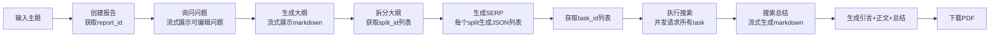

# 深度研究报告生成系统 - 前端

基于 React + TypeScript + Ant Design 的深度研究报告生成系统前端应用。

## 功能特性

- **6步完整工作流程**：从问题询问到报告生成的完整流程
- **流式输出**：支持 Markdown 和 JSON 的实时流式渲染
- **可视化进度**：清晰的步骤进度指示
- **可编辑内容**：支持修改生成的问题、大纲等内容
- **PDF/Word下载**：一键导出最终报告

## 技术栈

- React 18
- TypeScript
- Vite
- Ant Design 5.x
- React Markdown
- Axios

## 项目结构

```
frontend/
├── src/
│   ├── api/                    # API 调用封装
│   │   └── index.ts           # 所有后端接口调用
│   ├── components/             # 通用组件
│   │   ├── JsonViewer.tsx     # JSON 展示组件
│   │   ├── MarkdownRenderer.tsx # Markdown 渲染组件
│   │   ├── StepProgress.tsx    # 步骤进度组件
│   │   └── StreamDisplay.tsx   # 流式内容展示组件
│   ├── hooks/                   # 自定义 Hooks
│   │   ├── useReportFlow.ts    # 报告流程状态管理
│   │   └── useStreamFetch.ts   # 流式请求处理
│   ├── pages/                  # 页面组件
│   │   ├── Step1Questions.tsx  # 第一步：询问问题
│   │   ├── Step2Plan.tsx       # 第二步：生成大纲
│   │   ├── Step3Serp.tsx       # 第三步：生成 SERP
│   │   ├── Step4Search.tsx      # 第四步：执行搜索
│   │   ├── Step5Summary.tsx     # 第五步：搜索总结
│   │   └── Step6Final.tsx       # 第六步：最终报告
│   ├── types/                   # TypeScript 类型定义
│   │   └── index.ts
│   ├── App.tsx                  # 主应用入口
│   ├── main.tsx                 # 入口文件
│   └── index.css                # 全局样式
├── package.json
├── vite.config.ts
├── tsconfig.json
└── index.html
```

## 工作流程



## API 接口

后端运行在 `http://0.0.0.0:8000`，主要接口包括：

| 接口 | 方法 | 功能 |
|------|------|------|
| `/report/create` | POST | 创建报告 |
| `/ask_questions/stream` | POST | 流式生成问题 |
| `/plan/stream` | POST | 流式生成大纲 |
| `/plan/split/{report_id}` | POST | 拆分大纲 |
| `/serp/stream` | POST | 流式生成 SERP |
| `/serp/get_task_id/{split_id}` | GET | 获取任务 ID |
| `/search/search` | POST | 执行搜索 |
| `/summary/stream` | POST | 流式生成搜索总结 |
| `/final/introduction/{report_id}` | GET | 生成引言 |
| `/final/stream` | POST | 流式生成正文 |
| `/final/summary/{report_id}` | POST | 生成总结 |
| `/final/download/pdf/{report_id}` | GET | 下载 PDF |

## 安装和运行

### 环境要求

- Node.js >= 18.x
- npm >= 9.x

### 安装依赖

```bash
cd frontend
npm install
```

### 开发模式运行

```bash
npm run dev
```

前端将在 `http://localhost:3000` 启动。

### 构建生产版本

```bash
npm run build
```

### 预览生产构建

```bash
npm run preview
```

## 配置

### API 代理配置

在 `vite.config.ts` 中配置了开发环境的代理，将请求转发到后端服务器：

```typescript
server: {
  proxy: {
    '/api': {
      target: 'http://0.0.0.0:8000',
      changeOrigin: true,
    }
  }
}
```

### 修改 API 地址

如需修改后端地址，请编辑 `src/api/index.ts` 文件中的 `API_BASE` 常量：

```typescript
const API_BASE = 'http://0.0.0.0:8000';
```

## 各步骤功能说明

### 第一步：询问问题

- 输入报告主题
- 调用后端接口流式生成相关研究问题
- 支持编辑、删除、新增问题
- 保存问题后进入下一步

### 第二步：生成大纲

- 基于问题流式生成报告大纲（Markdown 格式）
- 支持编辑大纲内容
- 自动拆分大纲为多个章节

### 第三步：生成 SERP

- 为每个章节流式生成搜索引擎查询列表
- 以 JSON 格式展示 query 和 researchGoal
- 支持删除不需要的查询项

### 第四步：执行搜索

- 并发执行所有搜索任务
- 实时显示搜索进度和状态
- 支持重试失败任务

### 第五步：生成搜索总结

- 为每个搜索任务流式生成总结内容
- Markdown 格式展示
- 可折叠展开查看

### 第六步：生成最终报告

- 生成引言
- 并发生成各章节正文
- 生成总结
- 下载 PDF/Word 报告

## 注意事项

1. 确保后端服务已启动并运行在 `http://0.0.0.0:8000`
2. 部分接口需要较长的处理时间，请耐心等待流式输出完成
3. 搜索任务可能需要较长时间，建议在网络良好的环境下使用

## License

MIT
